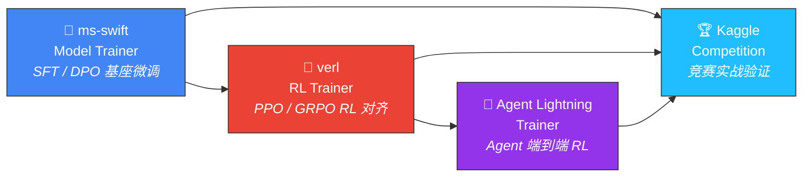

<p align="center">
  
  
  
</p>

<h1 align="center">🧠 Graph Skills</h1>

<p align="center">
  <b>AI Agent 研发与训练技能库</b><br/>
  为 Claude Code 提供结构化专业知识，覆盖从模型微调、强化学习训练到竞赛实战的完整 AI 工程链路
</p>

<p align="center">
  <a href="#-当前技能">技能总览</a> •
  <a href="#-技能链路">链路关系</a> •
  <a href="#-扩展规划">扩展规划</a> •
  <a href="#-使用方式">使用方式</a> •
  <a href="#-贡献">贡献</a>
</p>

---

## 💡 项目理念

传统 AI 开发依赖工程师记忆大量框架细节、调参经验和最佳实践。Graph Skills 将这些知识编码为**可复用的 Skill 模块**，让 AI 助手具备领域专家级的指导能力：

> 📦 每个 Skill = `SKILL.md`（核心知识）+ `references/`（深度参考）+ `scripts/`（可执行模板）

- 🏆 基于真实获奖方案和生产实践提炼，非泛泛的教程内容
- 🔄 持续跟踪框架更新和社区最佳实践
- 🔗 技能间相互关联，形成完整的 AI Agent 研发链路

---

## 📚 当前技能

###  ms-swift Model Trainer

> 🎯 大语言模型 / 多模态模型微调训练

使用 [ms-swift](https://github.com/modelscope/ms-swift)（ModelScope SWIFT, AAAI 2025）框架进行 LLM/MLLM 训练。

| 维度 | 覆盖范围 |
|------|---------|
| 📝 **训练方法** | SFT、DPO、GRPO、KTO、SimPO、ORPO、GKD、CPT |
| 🤖 **模型支持** | 600+ LLMs（Qwen3、DeepSeek-R1、Llama4、GLM-5...）、300+ MLLMs |
| ⚙️ **微调方式** | LoRA、QLoRA、全参数、Megatron 并行 |
| 🚀 **加速** | vLLM 推理加速（GRPO）、DeepSpeed ZeRO、序列并行 |

<details>
<summary>📂 目录结构</summary>

```
skills/ms-swift-model-trainer/
├── SKILL.md                          # 核心指南：训练流程、参数配置、模型选型
├── references/
│   ├── training_methods.md           # SFT/DPO/GRPO 详细参数与最佳实践
│   ├── training_patterns.md          # 训练模式与场景选择
│   ├── dataset_formats.md            # 数据集格式规范与转换
│   ├── hardware_guide.md             # 硬件选型与显存估算
│   ├── model_export.md               # 模型导出与部署
│   └── troubleshooting.md            # 常见问题与解决
├── scripts/
│   ├── train_sft_example.py          # SFT 训练模板
│   ├── train_dpo_example.py          # DPO 训练模板
│   ├── train_grpo_example.py         # GRPO 训练模板
│   ├── data_prepare_example.py       # 数据准备脚本
│   └── dataset_validator.py          # 数据集格式校验工具
```
</details>

---

###  verl RL Trainer

> 🎯 大语言模型强化学习后训练

使用 [verl](https://github.com/verl-project/verl)（字节跳动 Seed MLSys, EuroSys 2025 HybridFlow）框架进行 LLM RL 后训练。

| 维度 | 覆盖范围 |
|------|---------|
| 🧮 **RL 算法** | PPO、GRPO、GSPO、DAPO、DrGRPO、ReMax、REINFORCE++、RLOO、PRIME |
| 🔧 **训练后端** | PyTorch FSDP / FSDP2、Megatron-LM |
| ⚡ **推理引擎** | vLLM、SGLang、HF Transformers |
| 🌐 **分布式** | 基于 Ray 的弹性扩展，支持 671B 模型和数百 GPU |

<details>
<summary>📂 目录结构</summary>

```
skills/verl-rl-trainer/
├── SKILL.md                          # 核心指南：RL 训练流程、算法选择
├── references/
│   ├── algorithms.md                 # PPO/GRPO/DAPO 算法详解与调参
│   ├── config_guide.md               # 配置参数完整参考
│   ├── hardware_distributed.md       # 分布式训练与硬件配置
│   └── troubleshooting.md            # 常见问题与解决
├── scripts/
│   ├── train_ppo_example.py          # PPO 训练模板
│   ├── train_grpo_example.py         # GRPO 训练模板
│   ├── data_prepare_example.py       # 数据准备脚本
│   └── dataset_validator.py          # 数据集校验工具
```
</details>

---

###  Agent Lightning Trainer

> 🎯 AI Agent 强化学习训练

使用 [Agent Lightning](https://github.com/microsoft/agent-lightning)（Microsoft Research, EuroSys 2025）框架训练任意 AI Agent。

| 维度 | 覆盖范围 |
|------|---------|
| 🧪 **训练算法** | APO（自动提示优化）、VERL（GRPO/PPO RL 微调）、Tinker（快速 SFT） |
| 🔌 **Agent 兼容** | LangChain、AutoGen、CrewAI、LangGraph、纯 Python |
| ✨ **核心特性** | 零代码修改接入、Agent 执行与训练完全解耦、选择性优化 |
| 📊 **可观测性** | OpenTelemetry 全链路追踪（LLM 调用、工具调用、奖励） |

<details>
<summary>📂 目录结构</summary>

```
skills/agent-lightning-trainer/
├── SKILL.md                          # 核心指南：Agent RL 训练流程
├── references/
│   ├── algorithms.md                 # APO/VERL/Tinker 算法详解
│   ├── architecture.md               # 框架架构与组件说明
│   ├── config_guide.md               # 配置参数参考
│   └── troubleshooting.md            # 常见问题与解决
├── scripts/
│   ├── train_apo_example.py          # APO 提示优化模板
│   ├── train_multiagent_example.py   # 多 Agent 训练模板
│   └── train_verl_example.py         # VERL RL 微调模板
```
</details>

---

###  Kaggle Competition

> 🎯 数据科学 / ML 竞赛全流程实战

基于 AIMO 1/2/3、ARC Prize 2024/2025、LMSYS Chatbot Arena、Konwinski Prize 等真实获奖方案提炼的竞赛指南。

| 维度 | 覆盖范围 |
|------|---------|
| 🏟️ **赛道** | 表格、CV/医学图像、音频、NLP/LLM、数学推理、AGI推理、Agent代码、多模态 |
| 🛠️ **核心方法** | 特征工程、GBDT Stacking、LoRA/QLoRA 微调、TIR、TTT、GenSelect、蒸馏 |
| ⚡ **推理优化** | FP8/AWQ 量化、TensorRT-LLM、vLLM、SGLang、ReDrafter 投机解码 |
| 💡 **实战经验** | CV 策略、后处理、LB Shake-up 防御、GPU OOM 解决 |

<details>
<summary>📂 目录结构</summary>

```
skills/kaggle-competition/
├── SKILL.md                          # 核心指南：竞赛全流程方法论
├── references/
│   ├── competition_analysis.md       # 赛题解析方法论
│   ├── solution_design.md            # 方案设计与架构选择
│   ├── data_exploration.md           # EDA 与数据梳理
│   ├── opensource_analysis.md        # 开源方案分析框架
│   ├── iteration_strategy.md         # 方案迭代与分数优化
│   ├── llm_agent_competitions.md     # LLM/Agent 竞赛专题（AIMO3、ARC、Konwinski）
│   └── troubleshooting.md           # 常见问题与解决
├── scripts/
│   ├── eda_template.py               # EDA 分析模板
│   ├── feature_engineering.py        # 特征工程工具集
│   ├── cv_strategy.py                # 交叉验证策略模板
│   └── ensemble_template.py          # 模型融合模板
```
</details>

---

## 🔗 技能链路



**典型工作流**：

| 阶段 | 技能 | 目标 |
|------|------|------|
| 1️⃣ 基座微调 | **ms-swift** | SFT/DPO 微调 → 获得领域基础能力 |
| 2️⃣ RL 对齐 | **verl** | GRPO/PPO 强化学习 → 提升推理和对齐能力 |
| 3️⃣ Agent 训练 | **Agent Lightning** | 嵌入 Agent 系统端到端 RL → 工具使用和多步推理能力 |
| 4️⃣ 实战验证 | **Kaggle Competition** | 竞赛中验证迭代 → 约束条件下的实战表现 |

---

## 🗺️ 扩展规划

### 🔷 Phase 1: Agent 能力强化

| 技能 | 描述 | 状态 |
|------|------|:----:|
| 📏 **agent-evaluation** | Agent 评测框架（MLE-bench、SWE-bench、GAIA、TAU-bench），自动化性能基线测试 | 🔲 |
| 🎭 **agent-orchestration** | 多 Agent 编排（AutoGen、CrewAI、LangGraph），任务分解、协调、通信策略 | 🔲 |
| 🔌 **tool-integration** | Agent 工具设计（MCP 标准、Function Calling、工具文档规范），防止上下文膨胀 | 🔲 |

### 🔷 Phase 2: 训练基础设施

| 技能 | 描述 | 状态 |
|------|------|:----:|
| 🔄 **data-flywheel** | 数据飞轮：合成数据生成、主动学习、数据质量评估、去污染 | 🔲 |
| 🎯 **reward-engineering** | 奖励工程：Reward Model 训练、可验证奖励、Process Reward Model (PRM) | 🔲 |
| ⚡ **inference-optimization** | 推理优化：量化（FP8/AWQ/GPTQ）、TensorRT-LLM、vLLM/SGLang、投机解码 | 🔲 |

### 🔷 Phase 3: 前沿研究方向

| 技能 | 描述 | 状态 |
|------|------|:----:|
| 🧪 **test-time-compute** | 测试时计算扩展：Self-Consistency、TTT、GenSelect、Refinement Loops | 🔲 |
| 💻 **code-agent-training** | 代码 Agent 专项：SWE-bench 优化、代码生成/调试/修复、沙箱执行 | 🔲 |
| 👁️ **multimodal-agent** | 多模态 Agent：视觉-语言-代码融合、GUI Agent、Web Agent 训练 | 🔲 |

---

## 🚀 使用方式

本技能库设计为 Claude Code 的知识扩展。将 `skills/` 目录放置在项目中，Claude Code 会在相关场景自动激活对应 Skill：

| 触发关键词 | 激活技能 |
|-----------|---------|
| "微调"、"SFT"、"LoRA" | 🔧 **ms-swift Model Trainer** |
| "强化学习"、"PPO"、"GRPO"、"RLHF" | 🧮 **verl RL Trainer** |
| "Agent 训练"、"提示优化"、"Agent RL" | 🤖 **Agent Lightning Trainer** |
| "Kaggle"、"比赛"、"特征工程"、"AIMO" | 🏆 **Kaggle Competition** |

---

## 🤝 贡献

欢迎通过 Issue 或 PR 贡献新的 Skill 模块。每个 Skill 应包含：

| 组件 | 说明 |
|------|------|
| 📄 `SKILL.md` | 核心知识文档（含 frontmatter 元数据） |
| 📁 `references/` | 深度参考资料 |
| 📁 `scripts/` | 可直接执行的代码模板 |

---

<p align="center">
  <sub>MIT License &copy; 2025 Graph Skills</sub>
</p>
